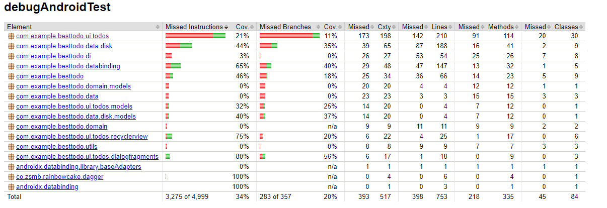
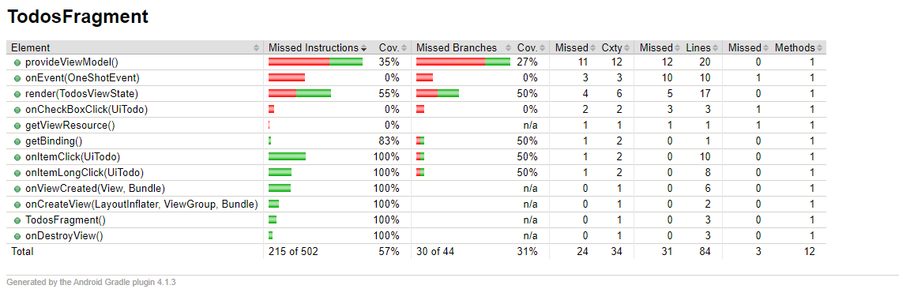

# Kód lefedettség
Az alábbiakban a tesztek által elért kódlefedettséget mutatom be.

## Elvégzett munka
A lehetőségek felderítése után a JaCoCo plugin gradlew createDebugCoverageReport parancsát választottam, ami egy html fájlban összegzi a komponensek lefedettségét.

## Eredmények összefoglalása

A képen látható a lefedettség.

Az alacsony értékek az architektúra rejtett elemeinek köszönhetők, hiszen azokat is vizsgálja a parancs.

Ha alaposan megvizsgáljuk a lefedettséget (navigálunk a html fájlban) akkor látható, hogy a releváns részek lefedettsége megfelelő.

