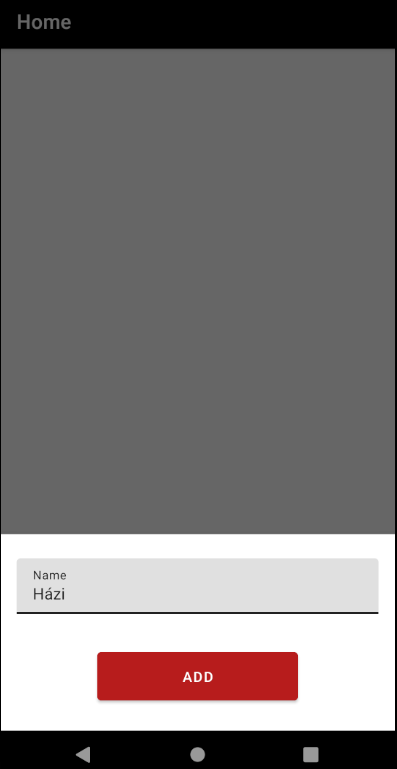
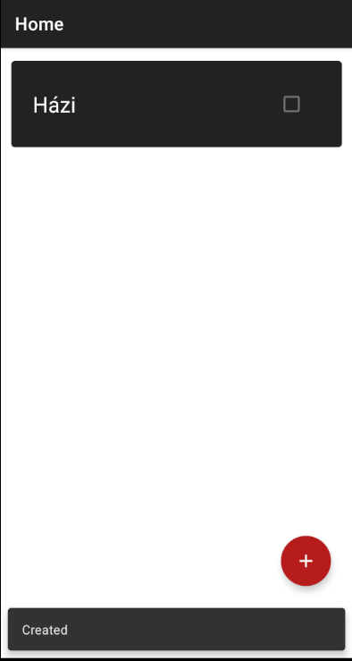
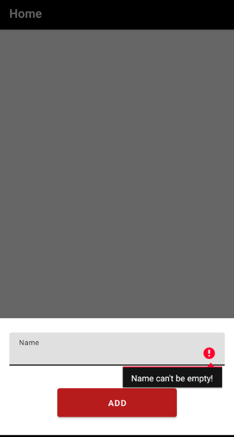
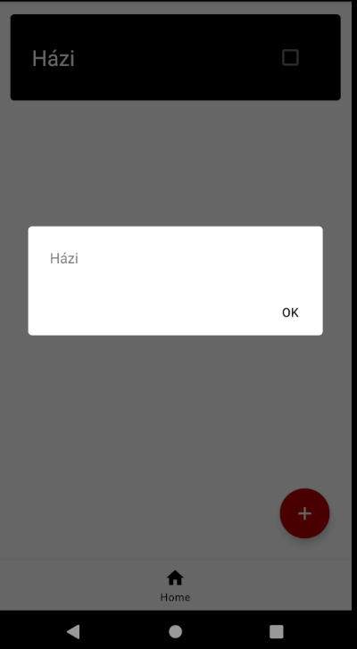
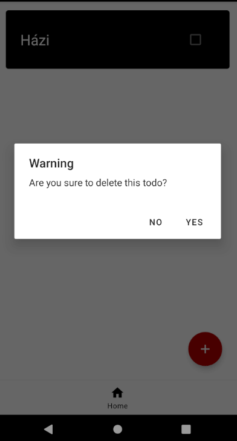
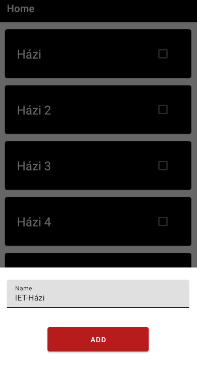
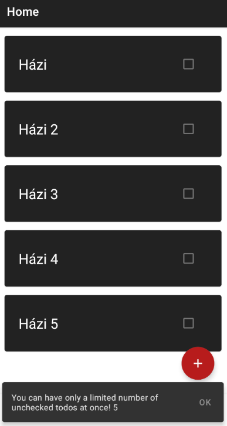

# Manuális tesztelés

Egy androidos alkalmazásnál nagyon fontos, hogy az elkészített alkalmazás könnyen használható legyen. Ennek tesztelésére a manuális tesztelés az alkalmas. Ilyenkor megnézhetjük, hogy minden úgy jelenik meg ahogy szeretnénk és minden funkció kényelmesen használható.

## Alapfukciók tesztelése

Teszt terv:
- Todo hozzáadása névvel
- Todo hozzáadása név nélkül
- Todo részleteinek megnézése
- Todo törlése
- Határok tesztelése

### Todo hozzáadása névvel

Az alábbi képeken jól látszódik, hogy egyértelmű visszajelzést kapunk a Todo létrejöttéről és meg is jelenik a listában.

### Todo hozzáadása név nélkül

Az alábbi képen látszódik egy figyelmeztetés, hogy nem töltöttük ki a név mezőt.

### Todo részleteinek megnézése

Egyszeri megnyomásra megnészhetjük a Todo részleteit.

### Todo törlése

Hosszan tartó nyomásra lehet törölni a Todo-t. Egy Todo-t nem lehet véletlenül törölni, mert megerősítést vár az alkalmazás a felhasználótól.

### Határok tesztelése

Ha van 5 pepipálatlan Todo, akkor nem enged hatodikat felvenni, mert csak 5 megcsinálatlan Todo lehet a listában.

## Következmény

A manuális tesztelésből látszódik, hogy minden felhasználó számára egyértelmű az alkalmazás használata, ez megkönnyítheti az alkalmazás elterjedését.

A manuális tesztelés egy részét el lehet végezni automatikusan is, de akkor nem kap visszajelzést a fejlesztő arról, hogy mennyire ergonomikus használni az alkalmazást.