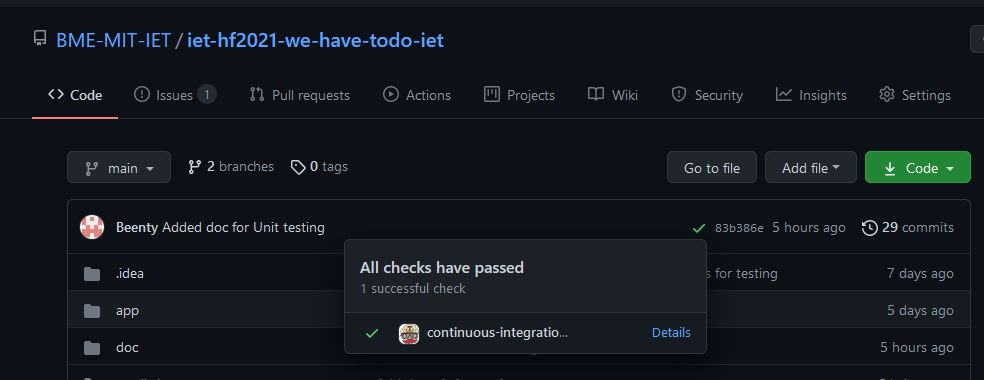

# TravisCI beüzemelése és használata a projekthez
Manapság nagyon gyakran használunk a megrendelt termék elkészítéséhez agilis módszertant. Ebből fakadóan a folytonos változtatatások ellenőrzése kihívást jelent ezekben a projektekben. Így a teszt automatizálás, és az ezt megvalósító CI toolok használata nagyon sokszor alapkövetelménynek tekinthető az ilyen jellegű projektekben.

## Elvégzett munka
A projekthez a TracisCI CI toolt választottam a sok elérhető CI tool közül. Azért erre az eszközre esett választásom, mert ingyenesen használható, és könnyedén integrálható bármely GitHubon található projekttel.

Először tehát hozzáadtam a projekthez a TravisCI-t. Ehhez létre kellett hoznom a projekt gyökérkönyvtárában a .travis.yml fájlt, amely tartalmazza az automatizált tesztek konfigurációját.
A csapat által választott projekt egy Android projekt volt. Emiatt külön érdekes volt és tanulságos, hogy ebben a fájlban hogyan lehet megadni a megfelelő konfigurációt, amely az egyszerű JVM tesztek futtatása mellett létrehoz egy android emulátort, amely képes futtatni az android specifikus úgynevezett instrumented teszteket is.

## Eredmények, összefoglalás
Sikerült tehát hozzáadnom a projekthez a TravisCI eszközt, és ezt megfelelően beüzemelnem. Az alábbi képen a projekthez kapcsolódó sikeres tesztre látható példa:

Ezen a képen pedig látható, hogy a sikeres integráció eredményeképpen a projekten is megjelenik az automatizált tesztek eredménye:

