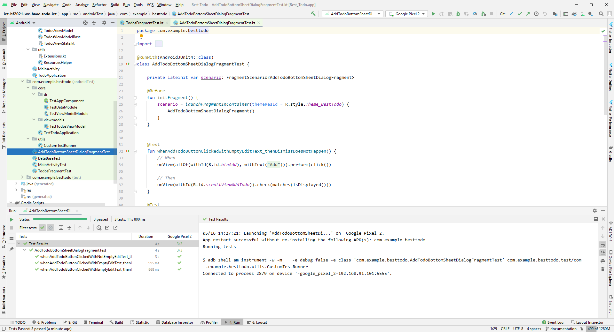

# UI tesztelés
A tesztelés nagyon fontos, hiszen így lehet megállapítani, hogy minden az elvártak szerint működik-e, és a jövőben az alkalmazás továbbfejlesztése során is nagyobb biztonságérzetet ad, hogy a meglévő funkciókhoz már vannak tesztek.

## Elvégzett munka
UI teszteléshez az **Espresso** keretrendszert használtuk, amivel gyakorlatilag felhasználói beavatkozásokat lehet kódból leírni, majd megvizsgálni, hogy a megfelelő tartalom van-e a képernyőn.

A tesztek egy valós vagy virtuális (emulátor) eszközön futnak. Ezekkel az alkalmazás MainActivity-jét és a Fragment-eket tesztelem. Mivel a Fragment-ek DI segítségével kapják meg a ViewModel-jüket, ezért mindegyik ViewModel egy absztrakt ősosztályból származik le. Így lehet elérni azt, hogy valós és tesztfuttatás során eltérő ViewModel-ek legyenek injektálva.

Teszt esetben a ViewModel-ek nem hívnak tovább a Presenter-jeik felé, csak visszatérnek valami előre megadott „dummy” adattal, ami a tesztelést segíti. A „dummy” adatokat is Dependency Injection segítségével kapják meg, ezt a TestDataModule provide-olja.

Azért, hogy a megfelelő DI modulok legyenek használva teszt környezetben, ezért a WorkoutTestApplication felel, aki létrehozza a DaggerTestAppComponent-et.

Az alábbi tesztek kerültek elkészítésre: MainActivityTest, TodosFragmentTest, AddTodoBottomSheetDialogFragmentTest

## Eredmények összefoglalás
Ezek a tesztek sokkal lassabban hajtódnak végre, mint a unit tesztek, hiszen ezekhez  kell egy külön eszközt elindítani, és arra telepíteni, majd azon még végrehajtani az utasításokat.

Alább látható egy sikeres ui teszt futtatás eredménye.

