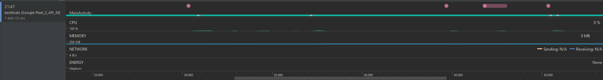

# Nem funkcionális jellemzők

## Elvégzett munka

Az alkalmazás futtatása közben az Android Studio beépített teljesítmény felügyelőjét (Profiler) használtam az adatok gyűjtéséhez.

## Eredmények összefoglalása

Látható, hogy az alkalmazás egyenletes teljesítménnyel üzemel, nincsenek kiugró értékek az egyes kérésekre történő reagáláskor.